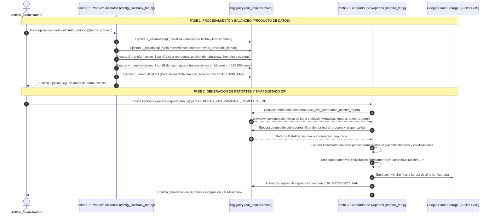

# Documento de Diseño de Arquitectura y Desarrollo: Integración FAH - Davibank

Este documento detalla el diseño de arquitectura y desarrollo del proceso de integración contable para **DAVIBANK_FAH** en Google Cloud Platform (GCP). Este flujo extrae, transforma, homologa, balancea y reporta la información transaccional de Davibank para ser consumida por **FAH (Financial Accounting Hub)** del Banco Davivienda.

---

## 1. Introducción al Flujo General

**FAH (Financial Accounting Hub)** es la herramienta centralizada de integración contable del Banco Davivienda. FAH requiere la entrega diaria de la información contable transaccional estructurada en un formato específico de archivos planos.

Para Davibank, el resultado de la integración se empaqueta en un único archivo comprimido **.Zip (Master ZIP)** que contiene exactamente **4 archivos individuales**:
1.  **Metadata (TXT):** Contiene información técnica y de control del archivo de entrega (por ejemplo, número de versión de la metadata y el nombre corto de la aplicación).
2.  **Header / Cabecera (CSV):** Detalla los datos a nivel de cabecera de la transacción (identificador de transacción, tipo de evento, libro contable, fecha efectiva, moneda, etc.).
3.  **Lines / Líneas (CSV):** Especifica el desglose contable de cada transacción, incluyendo número de línea, cuenta contable de destino homologada, naturaleza (débito/crédito) y el valor del movimiento en pesos colombianos (COP).
4.  **Control (TXT):** Reporta el resumen de cuadre y completitud indicando el número total de registros por cada tipo de archivo generado.

Este flujo completo se divide en **dos grandes frentes de desarrollo**:
*   **Frente de Producto de Datos (`Agente_Producto_Datos`):** Responsable de la ingesta diaria, la lógica de negocio (débito/crédito), el cálculo de consecuenciales de transacciones, la homologación contable y el balanceo físico de registros en BigQuery.
*   **Frente de Generador de Reportes (`Generador_Reportes_Fah`):** Responsable de la parametrización de metadatos de los reportes en BigQuery y la ejecución del script en PySpark para extraer la información, formatearla físicamente según codificaciones y delimitadores establecidos, empaquetar el ZIP y subirlo a GCS.

---

## 2. Diagrama de Arquitectura y Flujo (Mermaid)

El siguiente diagrama detalla la interacción entre los dos frentes, las bases de datos temporales/finales en BigQuery y el destino final de almacenamiento en Cloud Storage (GCS):

---

## 3. Frente 1: Producto de Datos (`Agente_Producto_Datos`)

Este frente gestiona el procesamiento de los datos contables puros. Su objetivo es tomar la información sin procesar (de la tabla intermedia `trf_davibank_fah`) y aplicar las reglas de negocio necesarias para estructurar los asientos contables en una tabla final balanceada.

### Estructura de Archivos
*   `config_davibank_fah.py`: Configura los metadatos de Airflow, parámetros de escritura particionada diaria en BigQuery por la columna `periodo`, y define el mapeo del orden de ejecución de los scripts SQL.
*   `Scripts/1_variables.sql` a `Scripts/5_select_final.sql`: Secuencia lógica de transformación en BigQuery.

### Análisis del Flujo de Scripts SQL

1.  **`1_variables.sql` (Inicialización):**
    Prepara el ambiente declarando las variables del orquestador: `@fecha_proceso` (tipo `DATE`) y `@libro` (tipo `STRING`, configurado con el valor `'BIFRS_DAV'`).

2.  **`2_filtrado.sql` (Aislamiento de Carga):**
    Crea la tabla temporal de trabajo `work_davibank_filtrado` extrayendo únicamente los registros del día que se está procesando. Esto optimiza los tiempos de procesamiento en BigQuery al restringir las lecturas por partición diaria.

3.  **`3_transformacion_1.sql` (Lógica Contable y Homologación):**
    Es el script central del procesamiento de datos y realiza las siguientes acciones:
    *   **Gestión de Reprocesos:** Consulta la tabla `STG_LOG_PROCESOS_FAH_PRUEBA` para evaluar ejecuciones previas del mismo periodo. Calcula un valor entero `CodigoReproceso` (ej: `1` para primera ejecución, `2` para el primer reproceso, etc.).
    *   **Unpivot de Cuentas:** Transforma el formato horizontal (débito/crédito en columnas independientes) a un formato vertical por transacciones. Genera una fila con `naturaleza = '1'` si hay un valor de débito, y una fila con `naturaleza = '2'` si hay un valor de crédito.
    *   **Generación del ID Único (`codigo_transaccion`):** Crea un código transaccional robusto uniendo el código de comprobante (`AK`), fecha efectiva, fecha de posteo, consecutivo y el código de reproceso. Esto garantiza una trazabilidad absoluta, previniendo duplicaciones si un archivo es reprocesado el mismo día.
    *   **Estandarización y Homologación de Cuentas:** Realiza un cruce (`LEFT JOIN`) con la tabla `mnl_homologaciones_fah`. Si la cuenta original de Davibank se encuentra parametrizada, la homologa al formato contable estandarizado del Banco Davivienda.

4.  **`4_transformacion_2.sql` (Balanceo Físico de Archivos):**
    Para cumplir con las capacidades técnicas de ingestión contable de FAH, las transacciones deben limitarse a bloques balanceados de máximo **150,000 registros por grupo**.
    *   **Lógica de Bloques:** Utiliza una ventana analítica con `SUM OVER` y `DENSE_RANK`.
    *   **Grupos Grandes:** Si una transacción masiva supera por sí sola las 150,000 líneas, se le asigna de forma exclusiva un `grupo_salida`.
    *   **Grupos Pequeños:** Las transacciones con menor volumen se van empaquetando consecutivamente en grupos de máximo 150,000 líneas.
    *   El campo `grupo_salida` se anexa a cada registro.

5.  **`5_select_final.sql` (Persistencia Final):**
    Inserta el conjunto de datos limpio, homologado y con su respectivo `grupo_salida` calculado en la tabla particionada de BigQuery: `cur_administrativa.DAVIBANK_FAH`.

---

## 4. Frente 2: Generador de Reportes (`Generador_Reportes_Fah`)

Este frente toma los datos limpios almacenados en `cur_administrativa.DAVIBANK_FAH` y genera los archivos de entrega física cumpliendo con las especificaciones rígidas de formato y empaquetado ZIP requeridas por FAH.

### Estructura de Archivos
*   `Parametria_Fah_Davibank.sql`: Script SQL que pre-configura e inserta los metadatos necesarios en las tablas del metamodelo de reportes.
*   `reporte_fah.py`: Orquestador escrito en Python que utiliza Spark para extraer los datos, darles formato físico, empaquetar el ZIP y enviarlo a GCS.

### Análisis del Generador y su Parametrización

1.  **Parametrización en el Metamodelo (`Parametria_Fah_Davibank.sql`):**
    Inserta la configuración para el reporte maestro (`GENERAR_FAH_DAVIBANK_COMPLETO_ZIP`) y sus **4 subreportes** asociados en las tablas maestras de BigQuery:
    *   `dav_mst_metadatos_master_report` (Cabecera del reporte y consultas SQL de extracción).
    *   `dav_config_documento_reporte` (Configuración del archivo: delimitadores, codificación, extensiones y nombres físicos de archivo).

    *Detalle de configuración de los reportes:*
    *   **ARCHIVO_METADATA_DAVIBANK:** Codificación `ISO-8859-1`, extensión `txt`, delimitador `,`. Nombre del archivo: `Metadata_DAVIBANK_{FORMATO_FECHA}_{CONTADOR}_de_{TOTAL_ARCHIVOS}_{VAR_REPROCESO}.txt`.
    *   **ARCHIVO_HEADER_DAVIBANK:** Codificación `UTF-8`, extensión `csv`, delimitador `,` con encabezados de columna. Nombre del archivo: `XlaTrxH_DAVIBANK_{FORMATO_FECHA}_{CONTADOR}_de_{TOTAL_ARCHIVOS}_{VAR_REPROCESO}.csv`.
    *   **ARCHIVO_LINES_DAVIBANK:** Codificación `UTF-8`, extensión `csv`, delimitador `,` con encabezados de columna. Nombre del archivo: `XlaTrxL_DAVIBANK_{FORMATO_FECHA}_{CONTADOR}_de_{TOTAL_ARCHIVOS}_{VAR_REPROCESO}.csv`.
    *   **ARCHIVO_CONTROL_DAVIBANK:** Codificación `UTF-8`, extensión `txt`, delimitador `,`. Nombre del archivo: `XlaCtl_DAVIBANK_{FORMATO_FECHA}_{CONTADOR}_de_{TOTAL_ARCHIVOS}_{VAR_REPROCESO}.txt`.
    *   **GENERAR_FAH_DAVIBANK_COMPLETO_ZIP (Reporte Maestro):** Genera el archivo ZIP que contendrá los cuatro archivos descritos. Nombre del archivo: `XlaTransaction_DAVIBANK_{FORMATO_FECHA}_{CONTADOR}_de_{TOTAL_ARCHIVOS}_{VAR_REPROCESO}.zip`.

2.  **Orquestador Spark (`reporte_fah.py`):**
    *   **Carga del Metamodelo:** Lee las tablas `dav_config_documento_reporte` y `dav_mst_metadatos_master_report` para inicializar dinámicamente las configuraciones y sentencias SQL de los 4 subreportes.
    *   **Cálculo de Secuencia de Reprocesos:** Invoca el método `obtener_valor_reproceso()` que valida contra `LOG_PROCESOS_FAH` para calcular el número de reproceso del periodo, asegurando que los nombres de los archivos finales incluyan el sufijo numérico correcto (ej: `_1.zip`, `_2.zip`).
    *   **Procesamiento por Grupos (`grupo_salida`):** Extrae de manera secuencial los registros agrupados por `grupo_salida`.
    *   **Generación de Archivos:** Escribe los archivos individuales planos en un directorio local temporal (`tempfile.mkdtemp()`), aplicando el encoding y los delimitadores definidos en el metamodelo para cada reporte.
    *   **Empaquetado y Compresión:** Agrupa los 4 archivos correspondientes a cada bloque y los comprime directamente en el archivo Master ZIP correspondiente, previniendo la anidación interna.
    *   **Carga a GCS (`subir_gcs`):** Ejecuta subprocesos nativos de GCP (`gsutil cp`) para subir el archivo `.zip` final al bucket de almacenamiento en la nube configurado en la variable `RUTA_DESTINO`.
    *   **Auditoría y Cierre:** Actualiza la tabla de auditoría `LOG_PROCESOS_FAH` registrando la fecha del procesamiento y el valor de reproceso para garantizar un control operacional estricto.
